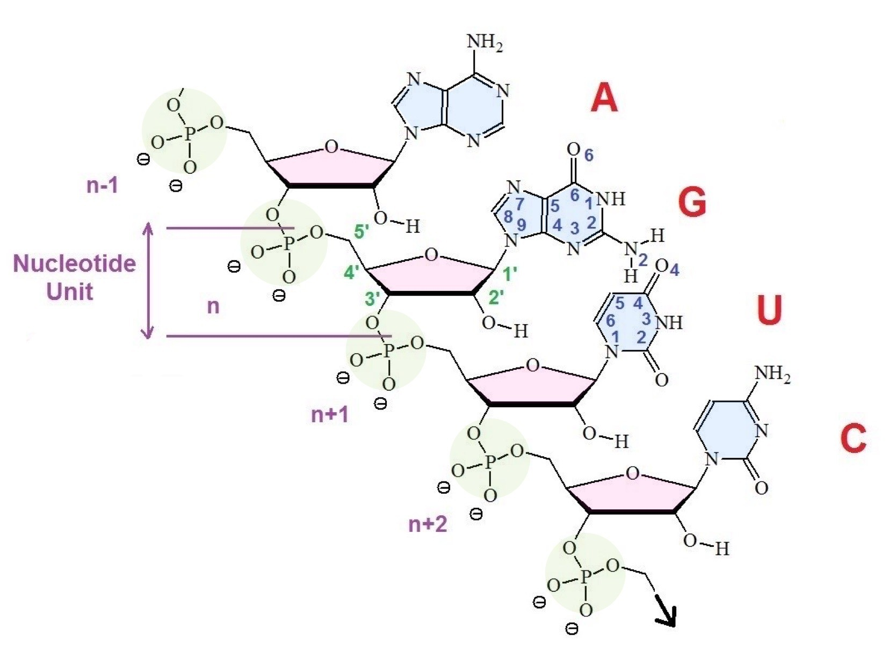
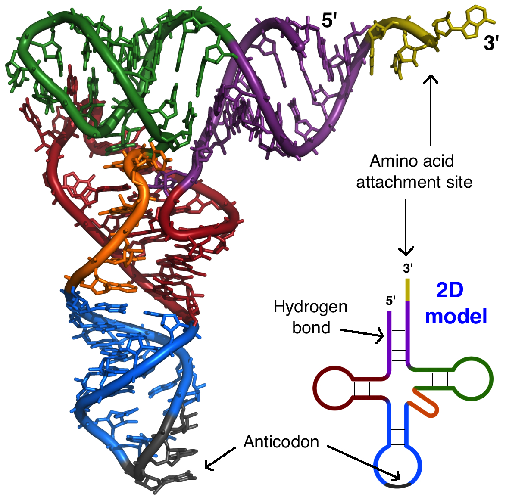
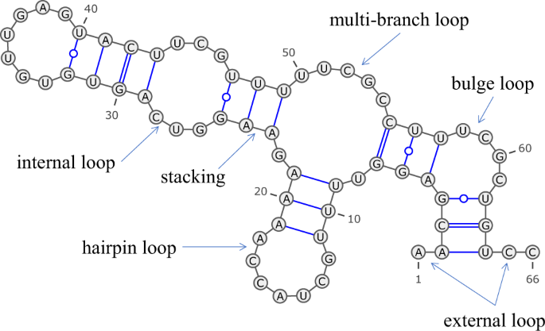
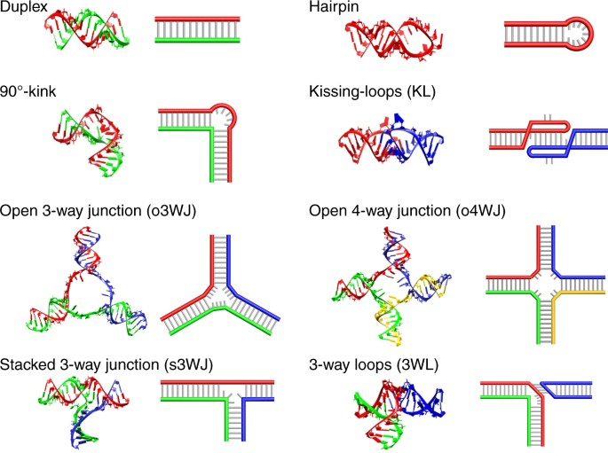
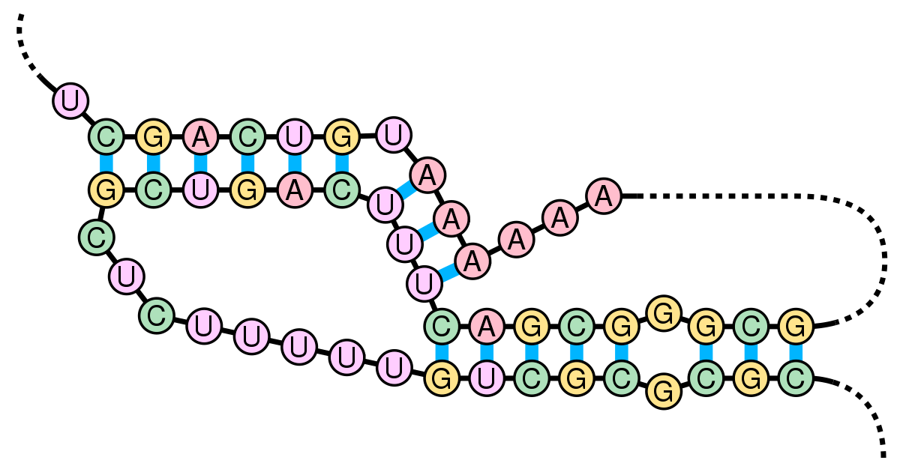
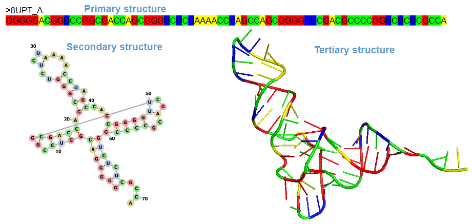

# RNA Structure Prediction (RASP) - 00 - RNA Folding

## Ribonucleic Acid (RNA)
RNA, or ribonucleic acid, is a molecule found in all living cells. It plays a crucial role in the transmission of genetic information and the synthesis of proteins.
RNA is similar to DNA (deoxyribonucleic acid) but has some structural and functional differences. RNA is composed of smaller subunits called nucleotides (same as DNA).
Each nucleotide consists of three components: sugar, phosphate group and nitrogenous base. There are four types of nitrogenous bases in RNA: adenine (A), cytosine (C), guanine (G), and uracil (U).

RNA atom arrangement (blue=nucleic base, green=phosphate group, red=sugar ring):
<p align="center">
 
</p>

## RNA Folding
RNA folding refers to the process by which a linear RNA molecule adopts a specific three-dimensional conformation or structure. During RNA folding, the molecule undergoes a series of conformational changes, driven by various interactions, to achieve its stable and functional folded state. The folded structure of RNA is crucial for its biological function, as it determines its interactions with other molecules and its ability to carry out specific cellular processes.

<p align="center">
 
</p>

## Primary Structure (RNA Sequence)
The primary structure of RNA refers to its linear sequence of nucleotides.

Example of an RNA sequence:
```
ACUUGCCACCGCUUCCUAAC
```

## Secondary Structure
When RNA folds, many of its nucleotides pair up with each other and form hydrogen bonds. These pairings are crucial for structure's stability and are best described with the secondary structure.

RNA secondary structure refers to the local folding patterns and interactions that occur within a single-stranded RNA molecule. It describes how regions of the RNA molecule fold upon themselves and form various stable structural motifs, such as hairpins, stems, loops, and bulges.

<p align="center">
 
</p>

Secondary structure structural motifs:
- One of the most common and fundamental structural motifs in RNA secondary structure is the **stem-loop** or **hairpin structure**. It consists of a stem, formed by base pairs, and a loop, which is a non-base-paired region. The stem can be short, consisting of just a few base pairs, or long, with multiple base pairs. Hairpin structures can occur within a single RNA molecule or between two separate RNA molecules.
- **Internal loops** occur when there is an unpaired region within the stem of a hairpin structure.
- **Bulges** are similar to internal loops but involve an unpaired nucleotide that disrupts the regular base pairing.
- **Junctions** are branching points where multiple helices meet, forming a three-dimensional network of interactions.
- **Pseudoknots** are structural motifs in which a single-stranded region of RNA pairs with a region outside its immediate vicinity, leading to the formation of intricate secondary structures.

Visualization of various structural motifs:
<p align="center">
 
</p>

Pseudoknot example:
<p align="center">
 
</p>


## Tertiary structure
RNA tertiary structure refers to the three-dimensional arrangement and folding of an RNA molecule. It is the spatial arrangement of atoms, bases or structural motifs. 

RNA tertiary structure is crucial for its biological function and can significantly impact its stability, activity, and interactions with other molecules.

Determining RNA tertiary structure is a complex task that often relies on experimental techniques such as X-ray crystallography, nuclear magnetic resonance (NMR) spectroscopy, cryo-electron microscopy, and computational modeling methods. Understanding RNA tertiary structure is crucial for unraveling the mechanisms underlying RNA function, design of RNA-based therapies, and the development of new drugs targeting RNA molecules.

<p align="center">
 
</p>

## Additional Information
- https://www.pnas.org/doi/pdf/10.1073/pnas.2112677119
- https://academic.oup.com/nar/article/51/18/9522/7272628
- https://en.wikipedia.org/wiki/Nucleic_acid_secondary_structure
- https://en.wikipedia.org/wiki/Pseudoknot
