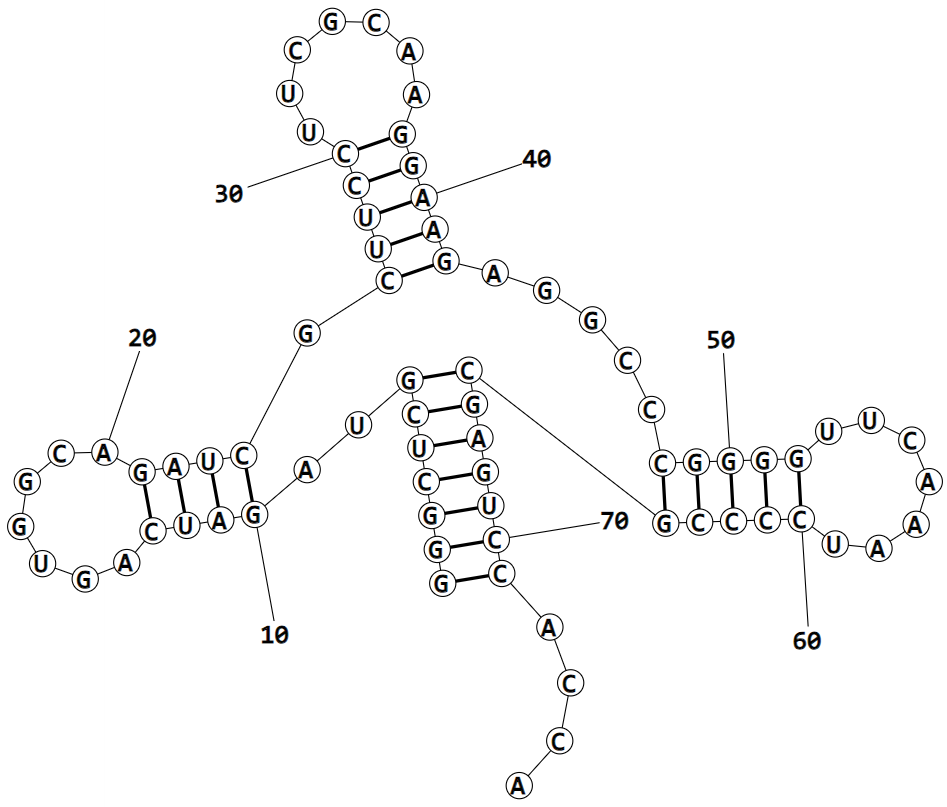

# RNA Structure Prediction (RASP) - 01 - Secondary Structure Dataset

## Data Download
To evaluate and train our structure prediction tools we need annotated secondary structures (the more the better).
In this tutorial we are going to use the popular [_ArchiveII_ dataset](https://rna.urmc.rochester.edu/pub/archiveII.tar.gz) which contains several thousand known secondary structures.

**TASK**: Download the _ArchiveII_ dataset from the provided link and unzip the downloaded files.

## Connectivity Table (CT) File Format (_.ct_)
Let's check what's inside of the _CT_ files we just downloaded. Open one of the files in the preferred text editors.

_CT_ format is one of the most popular ways to "encode" the secondary structure where every row describes the pairing status of a specific nucleotide in the RNA.
The structural information in the _CT_ format is denoted in six columns:
- The first column contains the sequence position, starting at one. (_n_)
- The second column contains the base in one-letter notation.
- The third column contains preceding nucleotide index. (_n - 1_)
- The fourth column contains succeeding nucleotide index. (_n + 1_)
- The fifth column contains the sequence index/position of the pairing partner of the base if the base is paired. If the base is unpaired, this column is zero.
- The sixth column contains natural numbering (usually the same value as in the first column).

First row in the file usually contains a short structure description (RNA family, sequence length, etc.).

CT file example:
```
119	5s_Acanthamoeba-castellanii-1
1	G	0	2	118	1
2	G	1	3	117	2
3	A	2	4	116	3
4	U	3	5	115	4
5	A	4	6	114	5
6	C	5	7	113	6
7	G	6	8	112	7
8	G	7	9	111	8
9	C	8	10	110	9
10	C	9	11	0	10
11	A	10	12	0	11
12	U	11	13	0	12
...
```

## Dot Bracket Notation (DBN) File Format (_.dbn_)
Another popular way to represent the secondary structure is dot bracket notation. Dot bracket files usually consists of three rows:
- The first line is a title and starts with a ">" character.
- The second line contains the sequence.
- The third line contains structure information in dot-bracket notation.
  - Each character represents a nucleotide. 
  - The dot/period "." represents an unpaired nucleotide.
  - Pairings are denoted by matching pairs of parenthesis.
  - Other "bracket"-type symbols can be used to represent basepairs, thereby allowing pseudo-knots to be encoded.
  - Example: `<(.>)` = First nucleotide is paired with the fourth one, second one is paired with the last one and third one is unpaired.
 
**TASK**: Implement a python script which will convert given '_.ct_' file into '_.dbn_' format (usage example: `python convert.py input.ct output.dbn`).

Dot Bracket file example:
```
>A pseudo-knot structure
GAUGGCACUCCCAUCAAUUGGAGC
(((((..<<<))))).....>>>.
```

## Secondary Structure Visualization
Previously described file format can come in handy when we want to save secondary structures but it is hard to draw any conclusion from them. How many loops are there in the structure? Are there any bulges? To answer these questions we need to visualize the structure with one of many available visualization tools. In this tutorial, we are going to use _RNAstructure_'s _draw_ utility tool. You can install _RNAstructure_ (and its utility tools) with the following command:
```
conda install bioconda::rnastructure
```

Example of a tRNA secondary structure:
<p align="center">
 
</p>


**TASK**: Choose one of the secondary structures from the _ArchiveII_ dataset, convert it into the dot-bracket file and create a '_.svg_' file with secondary structure visualization using the _draw_ tool (make sure to use the _.dbn_ file as the input). Open the generated '_.svg_' file in one of the image viewer programs and check how the structure looks like.

If you are unsure how to use _RNAStructure_'s _draw_, use the _--help_ option:
```
draw --help
```

## Exploratory Data Analysis
Finally, let's see what's exactly in the dataset we downloaded. Create a Jupyter notebook and implement a simple _Python_ method for _CT_ file parsing.

Once you can parse secondary structure files, answer the following questions about the dataset:
- How many secondary structures are there?
- What is the distribution of RNA sequence lengths?
- Are there any duplicate RNAs (RNAs with the same nucleotide sequence)?
  - If yes, how many and do they have the same secondary structure?
- What is the distribution of nucleic bases?
  - Do any "non-standard" nucleotide base letters appear (outside of A, C, U and G)?
- What is the distribution of base pairings?
  - Which nucleic bases pair up most often/rarely?
- What is the average percentage of unpaired nucleotides per RNA?
- Are there any structures without any pairings?

Feel free to explore other aspects of the dataset that are not mentioned here and we highly recommend you provide informative charts (e.g. bar chart, box plot, ...) whenever possible.

## Additional information
- https://www.ncbi.nlm.nih.gov/pmc/articles/PMC7202366/pdf/nihms-1583644.pdf
- https://www.ibi.vu.nl/programs/k2nwww/static/data_formats.html
- https://rna.urmc.rochester.edu/Text/File_Formats.html
- https://rna.urmc.rochester.edu/Text/draw.html
