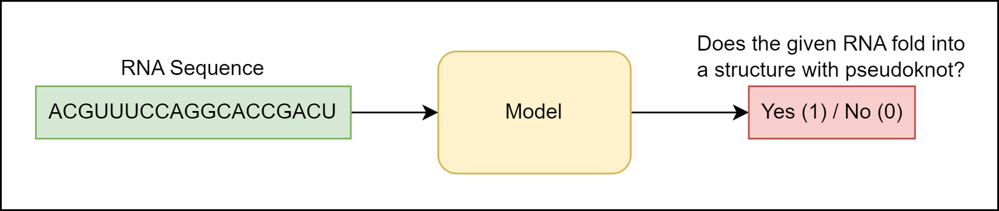

# RNA Structure Prediction (RASP) - 03 - Pseudoknot Detection

Before we try predicting the structure itself, let's try doing something a bit simpler. We'll try to predict whether or not a certain RNA folds into a structure with pseudoknot based on the RNA sequence alone. Basically, we are doing a relatively simple binary classification where the input in our model is the RNA sequence.

<p align="center">
 
</p>

## Training and evaluation data
Before we start dealing with anything else, we need to split our dataset into training, validation and test sets. Use _ArchiveII_ dataset as the starting point, remove sequence duplicates, cluster its sequences with _MMSeqs2_ and split the dataset into three parts accordingly (Reminder: RNAs from the same cluster should be in the same data split).

You will also have to assign a label to each RNA (1 if its structure contains pseudoknot and 0 if it doesn't). Save the sequences with their labels into a CSV file (make a separate CSV file for each dataset).

## Sequence featurization
Another thing we have to define is how are we going to featurize the RNA sequence. Raw RNA sequence tokens mean nothing to the model so we need to find a way to present them in a numerical form.

Simplest way to do this is to utilize [one-hot encoding](https://en.wikipedia.org/wiki/One-hot). We are going one-hot encode each nucleotide into a vector of 5 elements (4 for standard nucleic bases and 1 for all other symbols) and then concatenate these nucleotide representations into a longer vector which will serve as sequence vector representation which will be fed into the model.

Let's show how the described featurization works on a simple example:
```
One-hot encoding: [ADENINE, CYTOSINE, URACIL, GUANINE, ANYTHING ELSE]
Original sequence: AGUUNC
----------
One-hot encoding:
A = [1, 0, 0, 0, 0]
G = [0, 0, 0, 1, 0]
U = [0, 0, 1, 0, 0]
U = [0, 0, 1, 0, 0]
N = [0, 0, 0, 0, 1]
C = [0, 1, 0, 0, 0]
----------
Concatenation:
ACUUNG = [1, 0, 0, 0, 0, 0, 0, 0, 1, 0, 0, 0, 1, 0, 0, 0, 0, 0, 0, 1, 0, 1, 0, 0, 0]
```

You will probably also have to deal with padding since we are working with sequences of varying lengths. To solve this, simply concatenate zeros to the sequence representation vector so it matches the length of representation of the longest sequence in the dataset.

## Model and training
Once we have our dataset and a way to featurize the sequences, we can start training the models. Try training following models:
- [Logistic regression](https://scikit-learn.org/stable/modules/generated/sklearn.linear_model.LogisticRegression.html)
- [Random Forest](https://scikit-learn.org/stable/modules/generated/sklearn.ensemble.RandomForestClassifier.html)
- [XGBoost](https://xgboost.readthedocs.io/en/stable/)

Make sure to tune model hyperparameters on the validation set (use grid-search to find optimal hyperparameters). Don't forget to save the best performing models.

## Evaluation
Finally, the only thing remaining is to evaluate the trained model on the test dataset. Calculate (or visualize) following metrics:
- Accuracy
- Precision
- Recall
- F1
- Confusion matrix
- ROC curve (AUC)

If you think of any additional metrics / visualizations that might prove interesting, feel free to provide them as well.

## Additional information
- https://www.geeksforgeeks.org/ml-one-hot-encoding/
- https://machinelearningmastery.com/save-load-machine-learning-models-python-scikit-learn/
- https://neptune.ai/blog/evaluation-metrics-binary-classification
