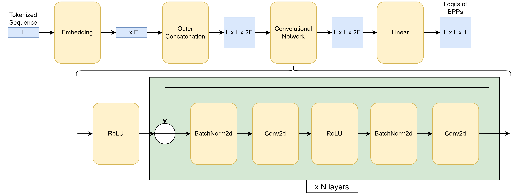
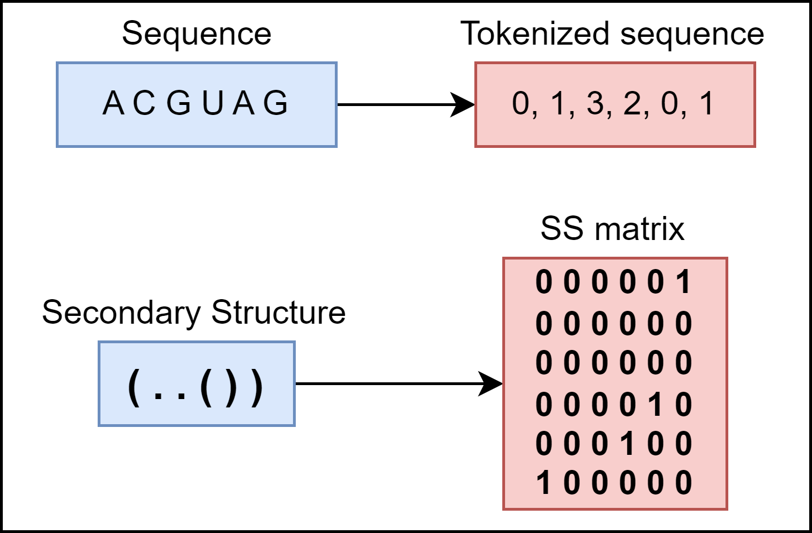

# RNA Structure Prediction (RASP) - 04 - Secondary Structure Prediction

## Model
In its simplest form, secondary structure prediction is a binary classification problem where we want to predict whether certain nucleotide pair is paired or not. If we do that prediction for every possible pair in the RNA, we should be able to reconstruct the secondary structure of that RNA.

This problem definition will be reflected in the architecture of our model. We will feed the tokenized sequence into the model, construct vector representations for each nucletoide pair and finally predict the pairing status of each pair.

More precisely, we will first convert sequence nucleotides into vector representations, apply outer concatenation on these representation to obtain pair representations which will then be forwarded to a convolutional network. More details about the model's architecture can be found on the image below.

Implement the described model. To help you, we prepared the code skeleton in the [rasp-04-code-skeleton](https://github.com/RJPenic/rna-ss/tree/main/tutorials/rasp-04-code-skeleton) directory. Fill out the missing parts of the code.

 

For the outer concatenation, the goal is to construct a tensor of shape L × L × 2E, where each entry corresponds to a pairwise concatenation of embeddings — one from position i and one from position j. Here's what happens step-by-step:

1. Input:
You start with a tensor X of shape L × E.

2. Expand X in two ways:
    -   Expand X to shape L × 1 × E — let's call this X1.

    - Expand X to shape 1 × L × E — call this X2.

This makes broadcasting possible for pairwise combinations.

3. Broadcast and concatenate:
-   Now, broadcast X1 and X2 to L × L × E each.

-   Concatenate along the last dimension:
    concat(X1, X2) → shape L × L × 2E

This gives a matrix where each [i, j] element is the concatenation of the embedding of position i and the embedding of position j:
[X[i], X[j]] ∈ ℝ^{2E}.

This outer concatenation allows a model to consider pairwise relationships between all elements in a sequence.

## Data
For model training and evaluation we are going to use the ArchiveII dataset. Split the dataset in the training, validation and test sets and make sure similar sequences remain in the same split.

Implement a method which will parse the given '_.ct_' file and return sequence of the RNA and the 2D representation of its secondary structure. Incorporate the implemented method in the data loading pipeline (e.g. _Dataset_ class if you are using _Pytorch_).

 

## Base Pairing Probabilities (BPP) Postprocessing
When it comes to classification, deep learning models output classification probabilities: "What's the probability of the input sample belonging to the class?". In our case, model will output base pairing probability (BPP) for each possible nucleotide pair in the RNA. Since we are doing secondary structure prediction, we need a way to convert BPP matrix into a proper secondary structure.

Implement a simple greedy approach where you will iteratively set nucleotide pairs with the highest pairing probability as paired and then exclude all possible clashing pairs from being set as paired in future iterations of the algorithm. During this procedure, ignore non-canonical nucleotide pairings and pairings that would cause a ”sharp” hairpin loop (_i_-th nucleotide cannot be paired with the _j_-th nucleotide if |_i_ − _j_| < 4).

## Training and evaluation
Training secondary structure prediction model should not differ much from the usual classification problem so you should be able to use a binary cross entropy loss during training. Train the model and evaluate it using precision, recall and F1 score metrics. Calculate each metric for each structure separately and then take the average values to prevent longer RNAs from influencing the metrics too much. Try out different model configurations (modify number of layers, embedding dimensionality, kernel size, etc.) to figure out what performs the best.

## Inter-family generalization evaluation
RNA families are groups of RNA molecules that share similar structural, functional, or evolutionary characteristics. In practice, we want our model to generalize to new, previously unseen RNA families. RNAs from the same family can have vastly diverse sequences. You might notice that this challenges our current data split strategy where we only consider sequence similarity. There is no guarantee that a certain RNA family won't appear in both training and evaluation sets.

Conveniently, ArchiveII dataset has annotated family of each structure in the name of the corresponding file (e.g. '_5s_Achromobacter-xylosoxidans-1.ct_' belongs to the 5S family). Check how many different RNA families there are in the ArchiveII dataset and resplit it in a way so you keep structures of one family for validation, structures of another one for testing and all other remaining structures for training. Train and evaluate the model with the new data split and compare the new results to old ones.

## Additional information
- https://www.ncbi.nlm.nih.gov/pmc/articles/PMC7202366/
- https://academic.oup.com/bioinformatics/article/38/16/3892/6617348
